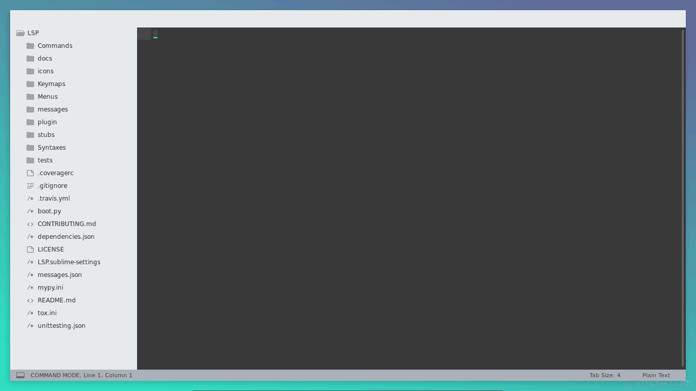

# GithubPR

Sublime text 3 plugin for checking out Github PRs.

1. In the command palette type `Github: Checkout Pull Requests`. 
2. This will list all the open PRs. Chose the one you would like to checkout.

Two more useful commands:
- `Git: Add Remote`: Add `origin` or `upstream` remotes. (There are only these two options, as they are the most common names for remotes).
- `Github: Sync Fork`: It will sync the `upstream` branch with the `master` branch. If you read the official guide for [syncing a fork](https://help.github.com/en/articles/syncing-a-fork), this command does exactly this. 